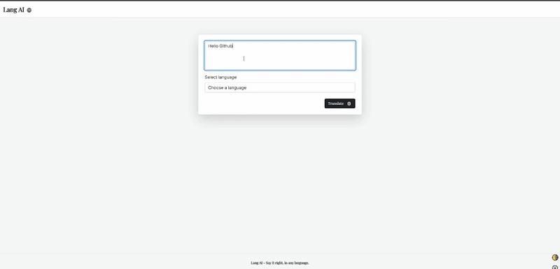

# 🌍 LangAI — Say it right, in any language

LangAI is a clean, full-stack .NET-based application that leverages the OpenAI GPT API to provide accurate and natural language translations. It features a minimal yet beautiful UI with dark mode support, Redis caching, unit testing, and flexible UI customization options.

---

## ✨ Features

- 🌐 Translate any text using OpenAI GPT-3.5
- ⚡ Redis caching (optional but supported)
- 🌓 Dark Mode Toggle
- 🛠️ Font & size customization in UI
- 🧪 Unit Tested Core Logic (TranslationService)
- 🧼 Clean Architecture: API / Application / Infrastructure / Domain / Tests
- 📦 Ready to deploy & easy to extend

---

## 📁 Project Structure

```
LangAI/
│
├── LangAI.API                # ASP.NET Core MVC App (UI layer)
├── LangAI.Application        # DTOs, Interfaces, Validators, Configs
├── LangAI.Domain             # Entities
├── LangAI.Infrastructure     # Services (OpenAI, Redis)
├── LangAI.Tests              # Unit tests with Moq + xUnit
└── LangAI.sln                # Solution file
```

---

## 🚀 How to Run

1. Clone the repo

```
git clone https://github.com/demollidrilon/LangAI.git
cd LangAI
```

2. Setup Redis locally _(optional)_  
   If Redis isn't available, LangAI will fallback gracefully without crashing.

3. Add your OpenAI API Key in `appsettings.json`:

```json
"OpenAI": {
  "URL": "https://api.openai.com/v1/chat/completions",
  "GTPModel": "gpt-3.5-turbo",
  "Temperature": 0,
  "MaxTokens": 256,
  "SecretKey": "sk-xxx"
}
```

4. Run it:

```
dotnet run --project LangAI.API
```

Then go to: `https://localhost:7102`

---

## 🧪 Run Unit Tests

```
dotnet test
```

---

## 🖼️ UI Preview

> Light + Dark mode support with settings panel:



---

## 🧠 Built With

- ASP.NET Core MVC (.NET 9 Preview)
- Clean Architecture (SOLID-friendly)
- OpenAI Chat Completions API
- Redis (via `IDistributedCache`)
- Bootstrap 5 / Custom CSS
- xUnit, Moq, FluentAssertions

---

## 📄 License

MIT - free for personal and commercial use.
